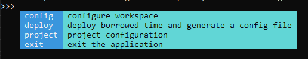

# Borrowed Time
Borrowed time is my personal project management application. As a security
consultant, I switched projects every week or two. This tool helps automate
some tasks such as project structure creation.

It's named after a discipline priest spell in World of Warcraft:

* https://www.wowhead.com/spell=213642/borrowed-time

Note: Borrowed Time is under heavy development. The API of sub-packages and
`prompter` might be modified.

## Capabilities

* Create and manage a workspace with a custom configuration.
* Create projects based on a json file representing the directory structure.
    * Project templates are json files. See below for details.
    * Each file can have a specific template using Go's template engine. It can
      incorporate custom items from the configuration file without having to
      recompile the app. See below for details.
* Use your favorite editor.
* Automatic editor detection on Windows.
* Add/remove/edit project/data/file templates.



## Operating System Support
Borrowed Time is mainly developed and used on Windows. Currently, only Windows
is supported. However, no OS dependent libraries are in use so default
editors/locations/paths can be added for other Operating Systems.

## Installation

1. Run `dep ensure` to download all vendored dependencies.
2. `go run main.go` or `go build` to build the program.

## dependencies
Borrowed Time directly uses the following packages:

* https://github.com/basgys/goxml2json
* https://github.com/c-bata/go-prompt
* https://github.com/mholt/archiver
* https://github.com/mitchellh/go-homedir
* https://github.com/olekukonko/tablewriter
* https://github.com/parsiya/golnk
* https://github.com/starkriedesel/prompter

## Quickstart
Execute Borrowed Time and run the `Deploy` command. Press `Tab` to see options
at any time. It creates a directory named `borrowedtime` in your home directory
and opens the configuration file in the default editor in your OS. Home is based
on [go-homedir](https://github.com/mitchellh/go-homedir). Home on Windows is
`C:\Users\[your-user]\`.

```
borrowedtime
│   config.json
│
├───backups
├───data
└───templates
    ├───file
    │       creds.md
    │       findings-submitted.md
    │       git-config.toml
    │       notes.md
    │       project-config.json
    │       readme.md
    │       scratch-pad.md
    │       todo-done.md
    │       todo.md
    │
    └───project
            issue-5.json
            project-structure.json
            project2.json
```

## Configuration File
Borrowed Time uses a configuration file to persist settings. It's a plaintext
JSON file. New entries can be added manually. These can be used in file/project
templates. A sample configuration file on Windows:

``` json
{
    "burppath": "",
    "editor": "C:/Program Files/Microsoft VS Code/Code.exe",
    "projectstructure": "project-structure",
    "workspace": "C:/Users/Parsia/Desktop/projects",
    "yourname": ""
}
```

## Commands
Borrowed Time has a few different commands.

### deploy
`deploy` installs Borrowed Time (creates the config file and the directory
structure) and opens the configuration file with the default editor
(notepad on Windows). The config file is pre-populated with some values
(e.g. VSCode as editor on Windows). Modify the config file to point to your
editor and your desired project root directory.


The project root directory is where all project directories are created.

### config
The `config` subcommand is used to manipulate the configuration. For example,
`config edit` opens the configuration file in the editor set in the config file.


* `backup` stores the config file and `data/templates` directories in a zip
    file under backup. The default name is based on the system's timestamp but
    it can be modified. You cannot overwrite backup files.
* `restore` silently creates a backup and then overwrites the config file,
    and `data/templates` directories.
* `edit` opens the configuration directory. This can be used to edit the
   configuration file or data/templates.


### project
`project` command creates and edits projects created inside the `workspace`
set in the config file. Each project is a separate directory. Borrowed Time
supports automatically creating projects and files inside them using a JSON
template file. See `Project Templates` below.

`list` prints a list of all top-level directories inside `workspace`.


`create` creates a new project inside the `workspace` with an optional file
containing the project structure and overwrite (false by default). Then opens
the project. First value after `create` is the project name.

Examples:

* `project create test1` - Create a new project named `test1`.
* `project create test1 -template template1` - Create a new project named `test1` using `template1.json`.
* `project create test1 -template template1 -overwrite` - Create a new project named `test1` using `template1.json` and overwrite any existing projects.

Note: `overwrite` does not delete the previous project directory. Existing files
that are not in the new template are not touched. Only files that are in both
templates are overwritten.

Note about project names with spaces:

* Use quotes to create projects with spaces (I personally do not):
    * `project create "project name with spaces"`
* Do not use quotes for projects without spaces:
    * Do not use `project create "test1"`.

`open` opens a project with the editor (if the editor supports opening
directories). The path to the project is passed to the editor as an argument.


## Templates
Borrowed Time can customize project structure and generated files with
templates. To edit templates use the `config edit` command to open the config
directory in the default editor.

### Project Templates
Project templates are JSON files in the following structure. They use the Go
[template engine](https://golang.org/pkg/text/template/).

* `Workspace` points to the root of your workspace.
* `ProjectName` is the name of the directory.

Project templates should be stored under the `templates/project` directory.

Note the children's path is relative to their parent. The tool is not looking
for full paths for children.

``` json
{
    "path": "{{ .Workspace }}/{{ .ProjectName }}",
    "info": {
        "isdir": true,
        "template": ""
    },
    "children": [
        {
            "path": ".config.json",
            "info": {
                "isdir": false,
                "template": "project-config"
            },
            "children": []
        },
        {
            "path": "@notes.md",
            "info": {
                "isdir": false,
                "template": "notes"
            },
            "children": []
        },
        {
            "path": "@pix",
            "info": {
                "isdir": true,
                "template": ""
            },
            "children": []
        },
    ]
}
```

As you can see, each file can have its own individual template (see below for
file templates). The value of `template` is ignored for directories.

### File Templates
File templates are text files. They can contain similar placeholders based on
the template engine. For example, the `notes` template is:

```
# {{ .ProjectName }} Notes

## 
```

File templates should be stored under the `templates/file` directory.

### Modifying Templates
File templates can be modified directly. Add new directories, files, and assign
file templates at you see fit. New templates can be added manually by dropping
them into the `templates` directory or more conveniently using the `config edit`
command that opens the config directory in the editor.

You can use sub-directories to manage templates but **each template name must be
unique deployment wide**. This means you cannot have two files named `notes.md`
inside the `templates` directory in different sub-directories. Extensions are
also ignored meaning you cannot have both `notes.md` and `notes.json`.

If you have duplicate template names, it will cause undefined behavior.

The template is addressed by the name of the file containing it without the
extension. You can choose any extension.

### Custom Fields in File Templates
It's possible to add custom items to the configuration file and use them in
the file templates without rebuilding the application. The project struct has
a field named `WorkspaceConfig` that is populated with a map of key/values from
the configuration file.

1. Add a new key to the config file. For example, `"customkey": "value"`.
2. Inside the file template, add: `{{ index .WorkspaceConfig "customkey" }}`.
   Keys are case-sensitive. Use only use lowercase keys for simplicity.
3. The placeholder will be replaced by the value of `customkey` from the
   configuration file.

Personally, I am very proud of how this part turned out.

## Data Files
Data files are located in the `data` directory and are free-format. They can be
used to incorporate data into your templates. To edit the data files, run
`config edit` to open the configuration directory in your editor.There used to
be a `data` command but it has been removed.

## License
Opensourced under the Apache License v 2.0 license. See [LICENSE](LICENSE) for
details.

## TODO:
Now in Github issues.

1. ~~Change error message in all unexported functions and remove module name.
   Only leave the error message?~~ [Issue #12](https://github.com/parsiya/borrowedtime/issues/12).
2. ~~Add `edit` command to template and data files.~~
3. ~~Update docs after `prompter` is released.~~
4. ~~Create gifs of some commands.~~
5. ~~Explain all commands.~~
6. ~~Add generation of Burp project based on a base Burp configuration file.~~ [Issue #13](https://github.com/parsiya/borrowedtime/issues/13)
    * ~~Research and add custom generation of Burp config files based on project
      using name, credentials, etc.~~
7. ~~Add `dep` support.~~
